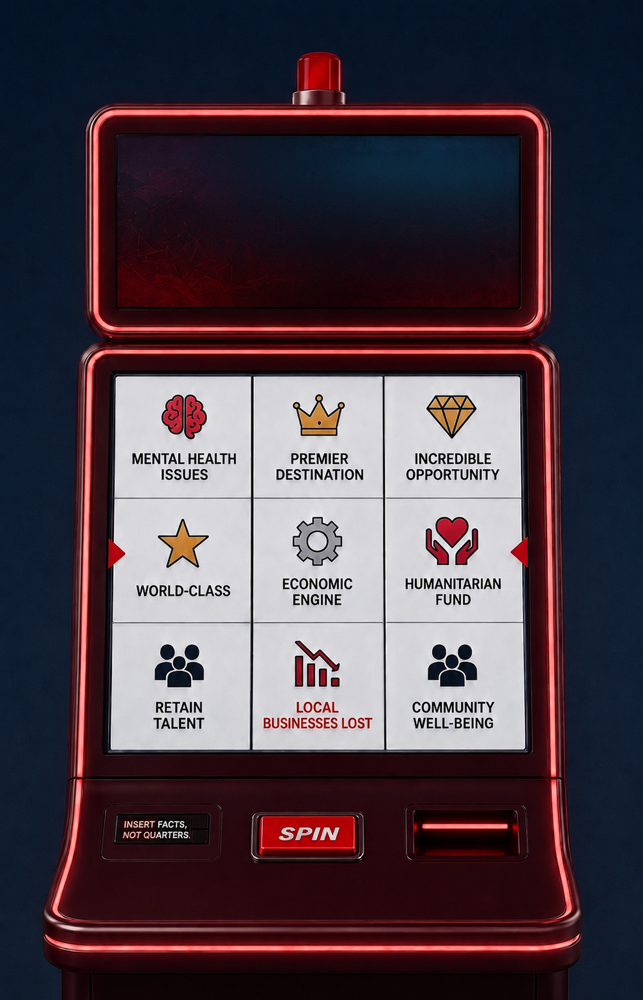

# Modern Slot Machine Replacement Plan

This document is the implementation handoff for replacing the existing hero-section slot machine with the modern digital slot machine shown in the reference image stored beside this plan.

## 0. Non-negotiable directives

- [ ] Replace the current old-style gold, rounded, mechanical slot-machine presentation with a modern dark-red digital cabinet based on the visual language of `modern-slot-machine-reference.png`.
- [ ] Treat `modern-slot-machine-reference.png` as **design documentation only**.
- [ ] **Do not import, serve, embed, preload, copy, crop, trace into a runtime asset, or otherwise use `modern-slot-machine-reference.png` anywhere in the application code or production asset pipeline.**
- [ ] **Do not use the reference image as an ``, CSS `background-image`, pseudo-element image, canvas texture, WebGL texture, screenshot overlay, placeholder, or fallback.**
- [ ] Recreate the machine with Razor/HTML, CSS, and JavaScript, matching the existing component's asset-light implementation approach.
- [ ] The existing Save Northeast Indiana logo asset may continue to be used. Do not add new raster or external SVG image assets for the cabinet, controls, outcome tiles, arrows, lights, icons, coin mechanism, or decorative surfaces.
- [ ] Use CSS, semantic HTML, existing local Material Symbols, and JavaScript-generated state where needed for those elements.
- [ ] Remove the lever. The reference design has no lever and the replacement must not retain one as an alternate spin path.
- [ ] Reduce the three reel-specific `PUSH` controls to **one prominent `SPIN` button** that spins the full machine on desktop and mobile.
- [ ] Ignore the `INSERT FACTS, NOT QUARTERS.` wording shown in the reference image. The lower-left control bay must instead contain a **modernized interactive coin-insert mechanism**.
- [ ] Preserve the existing concept of credits, coin insertion, outcome selection, spinning animation, siren/result feedback, mobile hero sequencing, and the intentionally contrasting "promotional claim" versus "community outcome" terms unless a requirement below explicitly replaces the current presentation.
- [ ] Do not create a new issue, branch, PR, backend endpoint, database table, or external dependency for this work.
- [ ] Follow `.agents/AGENTS.md`, especially the repository's UI text-size guardrails. Any visible label/supporting copy introduced or retained in the new machine must be at least 14px / `text-sm` equivalent. Primary numeric values should be `text-base` or larger.

---

## 1. Visual reference



### 1.1 What to take from the reference

Use the reference to guide proportion, hierarchy, materials, and control placement rather than to reproduce pixels literally.

- [ ] Tall, vertically organized cabinet with a substantial upper display and a lower interactive display/control body.
- [ ] Deep burgundy / oxblood cabinet rather than the current gold/brass cabinet.
- [ ] Glossy molded surfaces created with layered gradients, inset highlights, edge reflections, and shadows.
- [ ] Thin red illuminated trim around major cabinet sections rather than rows of incandescent bulbs.
- [ ] Centered red warning/siren beacon above the upper display.
- [ ] Dark upper screen with subtle red/blue illumination and restrained texture generated entirely in CSS.
- [ ] Main digital reel area presented as a clean **3-column by 3-row visible matrix**.
- [ ] White/light reel cells with dark separators, an icon and uppercase label in each cell, and red emphasis for negative community outcomes.
- [ ] Red left/right payline indicators aligned to the middle row.
- [ ] One large, centered, rectangular red `SPIN` button in the lower console.
- [ ] Lower-left control bay converted to the new coin-insert mechanism.
- [ ] Lower-right bay may be used for credit/status/coin-return styling, but it must not create a second competing spin or coin-insert affordance.
- [ ] Overall appearance should read as a contemporary electronic gaming terminal, not a vintage mechanical one.

### 1.2 What **not** to take literally

- [ ] Do not use the reference image itself in runtime code.
- [ ] Do not retain the `INSERT FACTS, NOT QUARTERS.` copy from the image.
- [ ] Do not create static screenshot-like tiles. Every visible tile must remain real DOM content that JavaScript can update.
- [ ] Do not add decorative image files for the brain, crown, diamond, star, gear, people, chart, hands/heart, arrows, coin slot, cabinet metal, reflections, smoke, or siren.
- [ ] Do not preserve the old mechanical lever simply because the current implementation supports it.
- [ ] Do not reproduce the current circular 3D reel geometry behind the new flat digital display.

---

## 2. Current implementation audit

The replacement should be implemented as a refactor of the current component, not as an unrelated second machine. Review these files before editing.

### 2.1 `SaveNEIN.Client/Pages/HeroSection.razor`

Current responsibilities to account for:

- [ ] The machine is embedded inside `.hero-visual-stage` and `.hero-slot-shell`.
- [ ] The current markup includes a separate back lever base and front lever arm/knob.
- [ ] `.slot-machine-wrapper` contains the siren, SaveNEIN marquee logo, dynamically populated perimeter lights, payline markers, three reel containers, three `PUSH` buttons, coin tray, credit counter, and coin insert.
- [ ] Each current reel uses `#reel-1`, `#reel-2`, and `#reel-3`.
- [ ] The three Razor `PUSH` buttons call the component's `SpinReel(int index)` method, which invokes `window.spinReel` through JS interop.
- [ ] First render calls `slotMachineSafeInit` through `IJSRuntime`.
- [ ] Mobile copy currently tells users to swipe to the Community Outcome Slot Machine.

Replacement implications:

- [ ] Remove both lever markup layers completely.
- [ ] Replace the old marquee/body/reel/control/tray structure with the new cabinet DOM structure rather than stacking the new design on top of old markup.
- [ ] Replace three reel buttons with one semantic `<button>` for `SPIN`.
- [ ] Prefer direct JavaScript event initialization inside `SlotMachine.init()` for the single button, or a single Razor interop callback if there is a strong reason to keep Blazor handling. Do not retain the obsolete three-index `SpinReel` bridge.
- [ ] Keep the machine inside the existing hero shell so the surrounding hero layout and mobile swipe model remain intact.

### 2.2 `SaveNEIN.Client/wwwroot/js/components/slot-machine.js`

Current reusable behavior:

- [ ] `BAIT_WORDS` and `TARGET_WORDS` already define the promotional claims and adverse community outcomes.
- [ ] Credits currently start at 2, spins consume one credit, a zero-credit spin triggers an alarm, and `insertCoin()` adds a credit after its animation.
- [ ] Each current reel is intentionally rigged so the payline resolves to a `TARGET_WORDS` outcome, with adjacent `BAIT_WORDS` used as near misses.
- [ ] Full-machine spinning is already staggered across three columns/reels.
- [ ] The siren has a timed active state after a completed full spin.
- [ ] Visibility tracking, mobile throttling, hero swipe navigation, delayed mobile initialization, resize handling, and defensive initialization already exist.
- [ ] Text fitting logic currently shrinks labels to fit narrow mechanical reel faces.

Current behavior that must be replaced or simplified:

- [ ] Remove `ITEM_HEIGHT`, 3D reel `RADIUS`, cylindrical `SLOT_COUNT` geometry, `rotateX(...) translateZ(...)`, accumulated `currentRotation`, and front/back target-index toggling if they are only needed by the old cylinder.
- [ ] Replace `initReels()`, `performSpin()`, and related cylindrical reel calculations with a digital-column/matrix implementation.
- [ ] Remove the desktop-only concept of spinning one individual reel at a time.
- [ ] Remove `window.spinReel` if nothing else uses it after the Razor refactor.
- [ ] Remove `initLever()` and all pointer/drag/click/keyboard lever handling.
- [ ] Replace geometry-driven `casino-lights` generation around the old rounded arch with modern trim/LED state handling. Prefer CSS-driven edge illumination rather than a large list of individually positioned bulb elements.
- [ ] Re-evaluate `ResizeObserver`. Keep it only for behavior that genuinely requires JavaScript recalculation after the new CSS-responsive layout is in place.
- [ ] Re-evaluate `fitSlotText()`. The digital grid should be designed to accommodate the known label set without repeatedly shrinking copy below the repository minimum. Prefer responsive cell sizing, line wrapping, and curated label layout over runtime font-size reduction.
- [ ] Preserve the existing offscreen/document-visibility performance protections where they are still useful.

### 2.3 `SaveNEIN.Client/Styles/app.css`

The current global source CSS contains nearly all of the old machine's visual system:

- [ ] Gold/brass `.slot-machine-wrapper` with rounded vintage arch.
- [ ] Old `.marquee-logo` housing.
- [ ] Incandescent `.casino-lights` bulbs and bulb state classes.
- [ ] Mechanical `.lever-*` styles and keyframes.
- [ ] 3D `.slot-window`, `.reel-container`, `.reel-strip`, `.slot-item`, `.reel-overlay` styles.
- [ ] Three circular `.reel-btn` controls.
- [ ] Large old-style `.coin-tray` assembly.
- [ ] Right-side `.coin-panel`, `.credit-counter`, `.coin-insert`, and animated coin styles.
- [ ] Current coin animation references quarter PNG assets under `/assets/quarter/`.
- [ ] Several old slot labels use font sizes substantially below the repository's current UI guardrail.

Replacement implications:

- [ ] Replace the old slot-machine component block with a cohesive modern component style block instead of layering large overrides on top of the old rules.
- [ ] Remove obsolete lever, incandescent bulb, cylindrical reel, three-button, old coin-tray, and old coin-animation selectors when no longer referenced.
- [ ] Do not use the quarter PNGs for the new machine. If a coin is visually represented during insertion, draw it with CSS/DOM and simple text such as `25¢`.
- [ ] Keep `SaveNEIN.Client/Styles/app.css` as the source of truth, then regenerate `SaveNEIN.Client/wwwroot/css/app.css` with `npm run build:css`.
- [ ] Do not hand-edit the minified `wwwroot/css/app.css` independently of the source CSS.

### 2.4 `SaveNEIN.Client/Pages/HeroSection.razor.css`

Current slot-related responsive behavior includes:

- [ ] Desktop scaling and vertical positioning of `.hero-slot-shell`.
- [ ] Mobile horizontal hero paging and centering of `.hero-visual-stage`.
- [ ] Mobile hiding of the lever.
- [ ] Mobile hiding of the first and third `PUSH` buttons, which leaves only the center button.
- [ ] Mobile overrides for old payline markers, old slot-window height, marquee-logo dimensions, old coin panel scaling, bulb sizing, and lever sizing.

Replacement implications:

- [ ] Preserve the horizontal mobile swipe/paging behavior.
- [ ] Delete selectors whose only purpose is hiding a lever or two of three buttons.
- [ ] Replace old cabinet-specific mobile overrides with sizing rules for the new digital cabinet.
- [ ] Make the single `SPIN` button the same interaction model at every breakpoint.
- [ ] Verify the new tall cabinet does not overflow or become clipped in the second mobile hero panel.
- [ ] Use responsive width/aspect constraints rather than heavy non-uniform `scale3d` distortion where possible. The modern machine should preserve its proportions.

### 2.5 `SaveNEIN.Server/Pages/Index.cshtml`

- [ ] Preserve `window.slotMachineSafeInit` unless the initialization contract is deliberately replaced everywhere.
- [ ] Preserve loading of `js/components/slot-machine.js` before Blazor starts.
- [ ] If the public API name changes, update the safe initializer and `HeroSection.razor` in the same change.
- [ ] Do not break `asp-append-version` cache-busting behavior.

### 2.6 `SaveNEIN.Client/wwwroot/index.html`

- [ ] Preserve the client-side fallback/static-host loading of `js/components/slot-machine.js`.
- [ ] If the script path is unchanged, no slot-specific change should be necessary here.
- [ ] If initialization is consolidated, verify both the ASP.NET hosted path and client `index.html` path still initialize correctly.

### 2.7 `SaveNEIN.Client/wwwroot/css/hero-entry-sequence.css`

- [ ] Preserve the mobile hero text/logo reveal sequence and reduced-motion behavior.
- [ ] The new machine must continue to work with the existing delayed swipe hints and the mobile gating performed by `slot-machine.js`.
- [ ] Do not tie the cabinet redesign to unrelated changes in the hero copy reveal timing.

### 2.8 Build and repository guardrails

- [ ] Run `npm run check:ui-text` after markup/CSS changes.
- [ ] Run `npm run build:css` after editing `SaveNEIN.Client/Styles/app.css`.
- [ ] Run `dotnet build SaveNEIN.sln` before completion.
- [ ] If local dev is needed, use only the repository-approved `npm run dev*` commands described in `.agents/AGENTS.md`.

---

## 3. Target component anatomy

The target should be one responsive machine composed of the following real DOM regions.

### 3.1 Cabinet root

Suggested conceptual structure:

```text
modern-slot-machine
├── siren
├── upper-display
│   ├── logo/status area
│   └── optional credits/message area
├── reel-housing
│   ├── payline-arrow-left
│   ├── digital-reel-grid
│   │   ├── column 1: top / payline / bottom
│   │   ├── column 2: top / payline / bottom
│   │   └── column 3: top / payline / bottom
│   └── payline-arrow-right
└── control-deck
    ├── modern-coin-insert
    ├── spin-button
    └── credit/status/coin-return bay
```

- [ ] Keep class names component-scoped and predictable, for example `modern-slot-*`, so obsolete `.reel-*` and `.lever-*` rules can be deleted cleanly.
- [ ] Give the cabinet a stable width and aspect relationship so it scales proportionally.
- [ ] Use multiple nested surfaces only when needed for border/glow/depth effects. Avoid decorative DOM bloat that could be handled with pseudo-elements.

### 3.2 Upper display

- [ ] Reproduce the reference's wide, dark upper screen using CSS gradients and inset shadows.
- [ ] The screen may contain the existing `assets/SAVENEIN.svg` logo and concise machine status/feedback, but the design should remain visually restrained.
- [ ] Do not bring back the old gold arched logo marquee.
- [ ] Useful states to support include `READY`, `SPINNING`, `INSERT COIN`, and a short post-spin result/status line.
- [ ] If credits are placed here, retain an element with a stable identifier for JavaScript updates, such as `#credit-display`.
- [ ] Do not make the upper screen a second result matrix. The 3x3 display below remains the focal interaction.

### 3.3 Digital reel grid

This is the key functional replacement for the old round/cylindrical reels.

- [ ] Render exactly three logical reel columns.
- [ ] Render three visible cells per column at rest: previous/near-miss above, active payline result in the middle, next/near-miss below.
- [ ] Present the nine visible cells as a clean 3x3 matrix like the reference image.
- [ ] Keep the **middle row as the payline**, indicated by CSS-generated left/right red arrows.
- [ ] Each cell must contain live DOM content, not an image.
- [ ] Each cell should support:
  - [ ] icon/symbol element,
  - [ ] outcome label,
  - [ ] semantic type/state such as `bait`, `truth`, `near-miss`, and `spinning`.
- [ ] Use existing local Material Symbols where appropriate. If a desired symbol is not available or looks wrong, use simple CSS geometry or inline semantic SVG markup. Do not add icon image files.
- [ ] Keep the known phrases legible at all supported widths without dropping below the UI text-size guardrail.
- [ ] Allow two-line labels such as `MENTAL HEALTH ISSUES`, `LOCAL BUSINESSES LOST`, `HUMANITARIAN FUND`, and `COMMUNITY WELL-BEING`.
- [ ] Use dark neutral text for ordinary/promotional cells and deep red for adverse `truth` outcomes.
- [ ] Do not rely on green as the sole differentiator between outcome types.

### 3.4 Digital spin motion

The new machine should still feel like a slot machine even though the visible design is flat/digital.

- [ ] Treat each of the three columns as a digital reel.
- [ ] On spin, cycle the column contents vertically at high speed, then decelerate and settle.
- [ ] Stagger column stop times from left to right, reusing the existing concept of approximately 200ms offsets unless tuning shows a better cadence.
- [ ] Use 2D `translateY`/opacity/blur or a compact rolling list. Do not recreate the old 3D cylinder with `rotateX` and `translateZ`.
- [ ] The final resting grid must be fully deterministic from the state selected before animation begins. Animation must not determine business/message logic.
- [ ] Avoid continuously mutating all nine cell nodes every animation frame. Prefer CSS transitions/keyframes with discrete JS updates at controlled intervals.
- [ ] Total spin duration can be shorter than the old 6.5 seconds if the new interaction feels more responsive, but allow enough time for clear staggered deceleration.
- [ ] During `prefers-reduced-motion: reduce`, skip rapid cycling and transition directly or with a short fade to the final state.

### 3.5 Single `SPIN` control

- [ ] Add one real `<button type="button">SPIN</button>` centered in the control deck.
- [ ] Give it a modern rectangular red illuminated appearance matching the reference, with pressed depth on pointer activation.
- [ ] Clicking/tapping it calls the full spin action, not one column.
- [ ] Enter and Space work automatically through native button semantics.
- [ ] Disable the button while spinning to prevent duplicate state transitions.
- [ ] Preserve the current credit requirement. A valid spin consumes one credit.
- [ ] When credits are zero, do not spin; trigger the credit alarm/status and direct attention to the coin insert.
- [ ] Remove all three old `PUSH` controls and all responsive logic that selectively hides two of them.

### 3.6 Modern coin insert

The lower-left bay in the reference is the target location, but not the reference text.

- [ ] Replace `INSERT FACTS, NOT QUARTERS.` with an interactive modern coin-insert assembly.
- [ ] The control should look like a current electronic machine payment slot rather than a chrome/vintage coin plate.
- [ ] Suggested visual language:
  - [ ] dark recessed rectangular module,
  - [ ] narrow vertical or horizontal slot,
  - [ ] subtle red LED guide/ring,
  - [ ] compact `25¢` and/or `INSERT COIN` copy at legal repository text sizes,
  - [ ] small status light that reacts to `ready`, `credit added`, and `no credits` states.
- [ ] Implement it as a real `<button>` or an accessible button-like control, not a bare clickable `<div>`.
- [ ] Preserve the existing `SlotMachine.insertCoin()` public behavior if practical.
- [ ] Clicking the coin insert adds one credit after a short feedback animation.
- [ ] Replace the large flying US-quarter image animation with a lightweight CSS/DOM effect. A small CSS-drawn metallic disc with `25¢` text is acceptable.
- [ ] Do not reference `/assets/quarter/USA_QUARTER_BACK_FRONT.png`, `/assets/quarter/USA_QUARTER_BACK_MEDIUM.png`, or any other coin image from the new component.
- [ ] Do not delete quarter assets solely because this component stops using them unless a repository-wide usage check confirms they are unused elsewhere and cleanup is intentionally included.

### 3.7 Lower-right bay

- [ ] Use the right bay for one supporting function, such as a modern credit display, coin return/recess, or concise machine status.
- [ ] Do not create a second `SPIN` control.
- [ ] Do not create a second coin-insert control.
- [ ] If credits remain in the upper display, the right bay can be primarily decorative/coin-return styling, but it must remain HTML/CSS rather than an image.

### 3.8 Siren and edge lighting

- [ ] Keep the top red siren as a recognizable result/alarm element.
- [ ] Restyle it to match the modern red cabinet rather than the vintage gold cabinet.
- [ ] Preserve `#siren` or provide a clear replacement selector used consistently by JavaScript.
- [ ] On successful spin completion, retain a short siren active sequence.
- [ ] For zero-credit alarm, use a distinct but related visual state.
- [ ] Replace dozens of individually generated round bulbs with CSS-based illuminated trim where possible.
- [ ] Use cabinet state classes such as `.is-spinning`, `.is-result`, `.is-credit-alarm` to drive edge-light behavior.
- [ ] Idle state may use a slow, low-intensity pulse. Spinning can use a traveling highlight. Result state can briefly intensify red glow.
- [ ] Avoid aggressive flicker. Respect reduced-motion preferences.

---

## 4. Behavioral contract and state model

### 4.1 Preserve the messaging model

- [ ] Keep `BAIT_WORDS` and `TARGET_WORDS` as the canonical label pools unless product copy is intentionally changed in a separate task.
- [ ] Initial/resting state should show recognizable promotional bait terms similar to the reference, such as `WORLD-CLASS`, `ECONOMIC ENGINE`, `HUMANITARIAN FUND`, `PREMIER DESTINATION`, `RETAIN TALENT`, and `COMMUNITY WELL-BEING`.
- [ ] A completed paid spin should resolve the payline to adverse `TARGET_WORDS`, preserving the existing rhetorical interaction.
- [ ] Top and bottom visible rows should function as nearby reel context/near misses, typically populated from `BAIT_WORDS`.
- [ ] The side arrows should make it unambiguous that the middle row is the selected payline.

### 4.2 Recommended JavaScript state

Replace geometry state with explicit UI state. Suggested shape:

```js
const state = {
    credits: 2,
    phase: 'idle', // idle | spinning | result | credit-alarm | coin-inserting
    columns: [
        { top: null, center: null, bottom: null },
        { top: null, center: null, bottom: null },
        { top: null, center: null, bottom: null }
    ]
};
```

- [ ] Keep state mutation centralized.
- [ ] Separate outcome selection from rendering and animation.
- [ ] Generate the final three column outcomes first.
- [ ] Animate toward those known outcomes.
- [ ] After the final column settles, transition to `result`, activate siren/edge feedback, and re-enable the spin button.
- [ ] Keep credits as integers and update all visual credit displays from one function.

### 4.3 Recommended outcome object

- [ ] Normalize words into objects so tile rendering can include an icon and type without hard-coded DOM branches throughout the animation code.

Example:

```js
{
    label: 'MENTAL HEALTH ISSUES',
    type: 'truth',
    icon: 'psychology'
}
```

- [ ] A small mapping from known label to Material Symbol name is acceptable.
- [ ] Provide a sensible generic fallback symbol so every phrase does not require bespoke artwork.
- [ ] Keep the label itself as the source of truth for message content.

### 4.4 Credit sequence

- [ ] Start with the existing initial credit count unless product requirements change.
- [ ] Valid `SPIN`:
  - [ ] confirm not currently spinning,
  - [ ] confirm credits > 0,
  - [ ] decrement one credit,
  - [ ] update display,
  - [ ] enter spinning state,
  - [ ] resolve/animate all three columns,
  - [ ] enter result state.
- [ ] Invalid zero-credit `SPIN`:
  - [ ] do not mutate reel results,
  - [ ] activate credit alarm,
  - [ ] visually emphasize coin insert,
  - [ ] announce the state accessibly.
- [ ] Coin insert:
  - [ ] block accidental repeated activation during the insertion animation or handle it deterministically,
  - [ ] play short CSS feedback,
  - [ ] increment credit,
  - [ ] update display,
  - [ ] clear the credit alarm.

---

## 5. Razor/HTML implementation plan

### 5.1 Replace machine markup in `HeroSection.razor`

- [ ] Keep the existing `.hero-visual-stage` and `.hero-slot-shell` outer integration points unless a rename is required by responsive cleanup.
- [ ] Delete both `.lever-container` blocks and all `#slot-lever` markup.
- [ ] Replace old `.slot-machine-wrapper` internals with the modern cabinet structure.
- [ ] Use semantic elements:
  - [ ] `<button>` for spin,
  - [ ] `<button>` for coin insertion,
  - [ ] `<output>` or a semantically labeled element for credits/status where appropriate,
  - [ ] list/grid semantics for outcome cells if useful without creating noisy screen-reader output.
- [ ] Keep stable IDs only where JavaScript requires them.
- [ ] Prefer `data-*` attributes for repeated tile/column discovery instead of nine unique hard-coded IDs.
- [ ] Keep `aria-hidden="true"` on purely decorative trim/arrows/reflections.
- [ ] Add an `aria-live="polite"` status region for credit/result messages.

### 5.2 Simplify Blazor interop

- [ ] Remove `SpinReel(int index)` after the three individual buttons are gone.
- [ ] Keep `OnAfterRenderAsync` initialization if the global JS module remains the component controller.
- [ ] If the single spin button uses JS event binding, no Razor click method is necessary.
- [ ] If a Razor click method is retained, expose one full-machine spin function only. Do not retain index-based reel control.

---

## 6. CSS implementation plan

### 6.1 Cabinet material system

Build the red cabinet without images.

- [ ] Deep burgundy base layer.
- [ ] Darker lower/side falloff to give the cabinet volume.
- [ ] Narrow brighter red specular edge highlights.
- [ ] Subtle inset inner shadow around both display housings.
- [ ] Thin illuminated red perimeter trim.
- [ ] Dark nearly-black seams between cabinet modules.
- [ ] Restrained reflection bands rather than exaggerated chrome.
- [ ] Use CSS custom properties for cabinet red, trim red, dark seam, screen blue-black, cell white, truth red, and glow intensities so tuning is centralized.

### 6.2 Upper display

- [ ] Use layered radial/linear gradients to create the dark blue-black screen with low red illumination at the bottom/left.
- [ ] Any texture should be CSS-generated and subtle. Do not use a texture image.
- [ ] Avoid visual noise that competes with the 3x3 matrix.

### 6.3 Matrix layout

- [ ] Use CSS Grid for the 3x3 visible face.
- [ ] Use equal column widths and row heights.
- [ ] Keep strong but narrow separators.
- [ ] Use a consistent internal padding system.
- [ ] Icons should scale with `clamp()` but labels must remain at least 14px.
- [ ] Use line clamping only if all full labels remain accessible; preferred behavior is natural two-line wrapping.
- [ ] Ensure no tile text is clipped at 320px-class mobile widths.

### 6.4 Animation classes

- [ ] Define clear classes for `is-spinning`, `is-settling`, `is-truth`, `is-near-miss`, `is-credit-alarm`, and `is-siren-active` as needed.
- [ ] Keep transition responsibilities in CSS and state sequencing in JavaScript.
- [ ] Avoid animating expensive large blurs every frame on mobile.
- [ ] Prefer transform and opacity for motion.
- [ ] Keep box-shadow/glow animation frequency modest.

### 6.5 Remove obsolete styles

After the new markup works, remove unused old slot selectors rather than leaving a dead parallel implementation.

- [ ] `.lever-container`
- [ ] `.lever-base`
- [ ] `.lever-arm`
- [ ] `.lever-knob`
- [ ] `.knob-text`
- [ ] lever keyframes
- [ ] `.casino-lights` and bulb-state rules if replaced fully by trim lighting
- [ ] old `.slot-window` / `.reel-container` / `.reel-strip` / `.slot-item` / `.reel-overlay` rules
- [ ] `.reel-controls` / `.reel-btn`
- [ ] old `.coin-tray*` rules if no longer used
- [ ] old quarter-image `.coin-face-*` rules if no longer used elsewhere
- [ ] obsolete small-screen overrides in `HeroSection.razor.css`

Do a usage check before deleting any shared selector or quarter asset.

---

## 7. JavaScript implementation plan

### 7.1 Refactor rather than duplicate

- [ ] Keep `window.SlotMachine` as the public module unless there is a compelling reason to rename it.
- [ ] Do not create `modern-slot-machine.js` while leaving the old `slot-machine.js` active. Replace the internals of the existing controller so there is one source of truth.
- [ ] Preserve `SlotMachine.init()` and `SlotMachine.insertCoin()` public methods where practical so hosting/init code changes stay small.

### 7.2 Replace reel construction

- [ ] Replace 15 three-dimensional faces per reel with the minimal data/DOM needed for the three visible rows and transient rolling content.
- [ ] Initialize each of three columns with bait terms.
- [ ] Populate icons and labels through a single tile renderer.
- [ ] Ensure all tile content can be refreshed without rebuilding the whole cabinet.

### 7.3 Spin pipeline

Suggested sequence:

1. [ ] `requestSpin()` validates credits and phase.
2. [ ] Build a final outcome model for all three columns.
3. [ ] Decrement credit and update the display.
4. [ ] Apply cabinet `is-spinning` state.
5. [ ] Start all columns rolling.
6. [ ] Settle column 1.
7. [ ] Settle column 2 after a short stagger.
8. [ ] Settle column 3 after a short stagger.
9. [ ] Render exact final top/center/bottom values for every column.
10. [ ] Apply truth styling to center payline results.
11. [ ] Remove spinning state, enable `SPIN`, trigger result/siren feedback, and announce the result.

### 7.4 Light/siren pipeline

- [ ] Replace the old requestAnimationFrame loop for many physical bulbs if the new edge trim can be driven with CSS state classes.
- [ ] Keep JavaScript responsible for high-level states and timers, not pixel-by-pixel light positioning.
- [ ] If a requestAnimationFrame loop remains for a visual effect, keep existing page-visibility and intersection gating.
- [ ] Clear timers/animation IDs cleanly if the component is reinitialized.

### 7.5 Mobile hero integration

- [ ] Preserve `setupHeroSwipeNavigation()` behavior.
- [ ] Preserve early mobile gating so the machine does not flash into view before the intended hero sequence.
- [ ] Preserve `mobileSequenceReady` and gated visibility semantics unless replaced with an equivalent that is demonstrably simpler.
- [ ] Confirm swipe gestures on the hero do not accidentally activate the coin slot or `SPIN` button.
- [ ] Use normal touch-action semantics on controls so taps remain reliable.

---

## 8. Accessibility requirements

- [ ] Single `SPIN` control is a native button.
- [ ] Coin insert is a native button or equivalent with full keyboard semantics.
- [ ] Visible focus states fit the red/dark visual system and remain high contrast.
- [ ] Disable `SPIN` with actual `disabled` semantics during spinning.
- [ ] Provide an accessible name for the coin insert, for example `Insert coin to add one credit`.
- [ ] Provide an `aria-live="polite"` status region for messages such as `Credit added`, `No credits. Insert coin to play`, and the completed payline result.
- [ ] Decorative siren/trim/arrows/icons should not flood the accessibility tree.
- [ ] Tile labels remain real text.
- [ ] Do not communicate adverse outcomes by red color alone. The text label itself is authoritative.
- [ ] Implement a `prefers-reduced-motion` path that avoids rapid reel cycling, siren beam rotation, chase effects, and large transforms.
- [ ] Do not introduce visible text below 14px.

---

## 9. Responsive requirements

### 9.1 Desktop

- [ ] Machine remains visually balanced beside the hero copy.
- [ ] Preserve enough breathing room around the top siren and cabinet glow.
- [ ] Do not distort the cabinet with aggressive non-uniform scaling.
- [ ] Main 3x3 labels remain readable without zoom.
- [ ] Lower controls remain visibly separate and easy to click.

### 9.2 Tablet and mobile

- [ ] Preserve the current two-panel horizontal hero experience: copy on the first panel, machine on the second.
- [ ] Fit the entire important interaction inside the viewport as reasonably as possible while allowing vertical breathing room.
- [ ] The siren must not be clipped by the hero panel.
- [ ] The 3x3 grid must not collapse below readable text sizes.
- [ ] If necessary, reduce decorative spacing/upper-screen height before reducing label font size.
- [ ] The coin insert and `SPIN` button must meet comfortable touch-target sizing.
- [ ] Remove the old mobile rule that hides first/last reel controls, because there will only be one control.
- [ ] Test narrow widths around 320, 360, 390, 420, and 640px, plus the 1023/1024 breakpoint transition.

---

## 10. Performance requirements

The new design should be lighter than the old mechanical simulation.

- [ ] Eliminate 45 cylindrical reel faces when no longer needed.
- [ ] Eliminate per-frame positioning/state updates for dozens of perimeter bulbs when CSS trim can provide the effect.
- [ ] Keep DOM count modest.
- [ ] Use transforms/opacity for rolling motion.
- [ ] Avoid forcing layout repeatedly during spin.
- [ ] Avoid repeated `offsetHeight` reads used only to force old 3D transitions.
- [ ] Avoid runtime text-fit loops that repeatedly measure and shrink every tile.
- [ ] Pause/skip nonessential animation when the machine is offscreen or the document is hidden.
- [ ] Do not add animation libraries.

---

## 11. File-by-file implementation map

### Required edits

#### `SaveNEIN.Client/Pages/HeroSection.razor`

- [ ] Replace old machine markup with modern cabinet markup.
- [ ] Remove lever markup.
- [ ] Remove three `PUSH` buttons.
- [ ] Add one `SPIN` button.
- [ ] Add 3x3 digital grid markup/containers.
- [ ] Move/rework credit and coin controls for the new lower deck/upper display.
- [ ] Remove obsolete `SpinReel(int index)` Razor method.
- [ ] Retain initialization call in a compatible form.

#### `SaveNEIN.Client/Pages/HeroSection.razor.css`

- [ ] Re-tune `.hero-slot-shell` dimensions/positioning for the taller modern cabinet.
- [ ] Replace old machine-specific mobile overrides.
- [ ] Preserve hero swipe/paging and reveal behavior.

#### `SaveNEIN.Client/Styles/app.css`

- [ ] Replace old slot component style block with modern cabinet, display, grid, controls, coin insert, siren, and state styles.
- [ ] Remove unused old component rules after markup migration.
- [ ] Add reduced-motion handling for slot-specific effects.

#### `SaveNEIN.Client/wwwroot/js/components/slot-machine.js`

- [ ] Replace 3D reel geometry with digital column/grid logic.
- [ ] Convert to one full-machine spin action.
- [ ] Remove lever logic.
- [ ] Simplify lights to high-level state handling.
- [ ] Preserve credits, coin insert API, outcome pools, mobile gate/swipe behavior, and siren/result feedback.

#### `SaveNEIN.Client/wwwroot/css/app.css`

- [ ] Regenerate from source with `npm run build:css`.
- [ ] Do not manually diverge it from `Styles/app.css`.

### Conditional edits

#### `SaveNEIN.Server/Pages/Index.cshtml`

- [ ] Edit only if the `SlotMachine.init()` public contract changes.
- [ ] Keep safe initialization behavior and script order intact.

#### `SaveNEIN.Client/wwwroot/index.html`

- [ ] Edit only if script path/API changes require it.
- [ ] Preserve loading before Blazor startup.

#### `SaveNEIN.Client/wwwroot/css/hero-entry-sequence.css`

- [ ] Edit only if the new machine requires a mobile reveal compatibility adjustment.
- [ ] Do not change unrelated intro timing without a specific reason.

### Reference-only documentation files

#### `docs/plans/pipeline/modern-slot-machine/modern-slot-machine-reference.png`

- [ ] Keep beside this plan for human/agent visual comparison only.
- [ ] **Never reference this path from application/runtime source.**

#### `docs/plans/pipeline/modern-slot-machine/modern-slot-machine-plan.md`

- [ ] Keep this checklist updated if implementation decisions materially change.

---

## 12. Implementation phases

### Phase 1: Baseline and dependency check

- [ ] Read `.agents/AGENTS.md`.
- [ ] Review the current `HeroSection.razor`, `HeroSection.razor.css`, `Styles/app.css`, and `slot-machine.js` before editing.
- [ ] Confirm no other source file calls `window.spinReel`, `spinReel(...)`, `#slot-lever`, `.reel-btn`, or old coin selectors before deleting them.
- [ ] Confirm the mobile hero still depends on `SlotMachine.init()` gating/swipe setup.
- [ ] Confirm the reference image is documentation-only and will not be copied into runtime assets.

### Phase 2: Markup skeleton

- [ ] Replace old machine DOM with modern cabinet regions.
- [ ] Add upper screen.
- [ ] Add 3x3 grid structure.
- [ ] Add payline arrows.
- [ ] Add lower-left coin insert.
- [ ] Add centered `SPIN` button.
- [ ] Add right credit/status/return bay.
- [ ] Keep siren.
- [ ] Remove lever and three buttons.

### Phase 3: Static visual fidelity

Before wiring spin behavior:

- [ ] Match overall cabinet proportion to the reference.
- [ ] Match dark red glossy material.
- [ ] Match thin red edge illumination.
- [ ] Match dark upper screen.
- [ ] Match crisp light 3x3 tiles and separators.
- [ ] Match middle-row side arrows.
- [ ] Match lower console layout.
- [ ] Ensure the new coin insert reads as modern, not vintage.
- [ ] Confirm there is no reference-image runtime usage.

### Phase 4: Digital reel behavior

- [ ] Implement tile data model.
- [ ] Initialize bait state.
- [ ] Implement final outcome selection.
- [ ] Implement vertical digital cycling.
- [ ] Implement left-to-right staggered stop.
- [ ] Highlight center-row truth outcomes.
- [ ] Keep top/bottom rows as near-miss context.
- [ ] Add single-button locking while spinning.

### Phase 5: Credits, coin, siren

- [ ] Wire credit decrement on spin.
- [ ] Wire zero-credit alarm.
- [ ] Wire modern coin insert and credit increment.
- [ ] Remove quarter-image dependency from slot behavior.
- [ ] Wire siren/result state.
- [ ] Wire upper display/status state if used.

### Phase 6: Responsive and hero integration

- [ ] Remove old lever/three-button mobile CSS.
- [ ] Fit cabinet inside existing hero desktop layout.
- [ ] Fit cabinet inside mobile second panel.
- [ ] Verify hero horizontal swipe still works.
- [ ] Verify early/mobile reveal gate still works.
- [ ] Verify controls do not accidentally trigger swipe behavior.

### Phase 7: Accessibility and reduced motion

- [ ] Verify native button behavior.
- [ ] Verify focus indication.
- [ ] Add live status announcements.
- [ ] Verify all machine copy >= 14px.
- [ ] Verify reduced-motion mode.
- [ ] Verify no information is conveyed only by animation or color.

### Phase 8: Cleanup

- [ ] Delete dead lever JS.
- [ ] Delete dead 3D reel JS.
- [ ] Delete dead individual-reel interop.
- [ ] Delete obsolete bulb geometry code if edge lighting fully replaces it.
- [ ] Delete old CSS selectors that no longer match markup.
- [ ] Keep quarter assets only if used elsewhere; remove slot references to them.
- [ ] Confirm no console errors from stale element lookups.

### Phase 9: Build and validation

- [ ] Run `npm run check:ui-text`.
- [ ] Run `npm run build:css`.
- [ ] Run `dotnet build SaveNEIN.sln`.
- [ ] If development preview is required, use only approved `npm run dev*` process-control commands.
- [ ] Inspect desktop and mobile manually.

---

## 13. Manual verification matrix

### 13.1 Visual

- [ ] Cabinet is dark red/burgundy, not gold.
- [ ] Cabinet reads as a modern electronic slot terminal.
- [ ] Siren is centered and visually integrated.
- [ ] Upper display resembles the reference's dark screen.
- [ ] Main reel face is visibly 3 columns x 3 rows.
- [ ] Middle row has clear red payline arrows.
- [ ] No mechanical lever exists.
- [ ] Exactly one `SPIN` button exists.
- [ ] Lower-left bay contains a modern coin insert, not `INSERT FACTS, NOT QUARTERS.`
- [ ] No screenshot/reference image is visible in the page.
- [ ] No new raster artwork is used for tile icons or cabinet details.

### 13.2 Functional

- [ ] Initial state renders valid bait labels.
- [ ] `SPIN` consumes one credit.
- [ ] All three digital columns animate from one button press.
- [ ] Columns settle left-to-right.
- [ ] Center payline resolves to intended truth/adverse outcomes.
- [ ] Top/bottom rows display near-miss/context labels.
- [ ] Spin button cannot start a second overlapping spin.
- [ ] Result/siren feedback occurs after settling.
- [ ] At zero credits, spin is blocked.
- [ ] Zero-credit state emphasizes the coin insert.
- [ ] Coin insertion adds one credit.
- [ ] After coin insertion, spinning works again.

### 13.3 Keyboard/accessibility

- [ ] Tab reaches coin insert and `SPIN` in a logical order.
- [ ] Enter/Space activates both controls.
- [ ] Disabled spin state is exposed while spinning.
- [ ] Status changes are announced without reading every animation frame.
- [ ] Focus rings are visible.
- [ ] All visible copy respects the repository minimum size.
- [ ] Reduced motion produces a usable non-rapid sequence.

### 13.4 Responsive

- [ ] 320px width.
- [ ] 360px width.
- [ ] 390px width.
- [ ] 420px width.
- [ ] 640px width.
- [ ] 768px width.
- [ ] 1023px width.
- [ ] 1024px width.
- [ ] Typical 1366px desktop width.
- [ ] Wide desktop around 1440-1920px.
- [ ] No horizontal page overflow outside the intentional mobile hero swipe track.
- [ ] No clipped siren, payline arrows, button, or coin insert.

### 13.5 Runtime asset audit

Use browser devtools/network or repository search.

- [ ] No request is made for `docs/plans/pipeline/modern-slot-machine/modern-slot-machine-reference.png`.
- [ ] No application source file contains a runtime reference to that documentation image.
- [ ] No new cabinet/tile PNG/JPG/WebP asset has been added.
- [ ] The existing logo is the only image asset intentionally needed by the machine itself.
- [ ] The new coin animation does not request quarter PNGs.

---

## 14. Acceptance criteria

The replacement is complete only when all of the following are true:

- [ ] The old gold mechanical cabinet is gone.
- [ ] The new cabinet visibly follows the supplied modern dark-red reference.
- [ ] The reference image exists only under this documentation plan directory and is not used by runtime code.
- [ ] The machine is constructed from Razor/HTML, CSS, and JavaScript, with the existing SaveNEIN logo as the only permitted machine image asset.
- [ ] The old round/cylindrical 3D reels are gone.
- [ ] The new visible reel interface is a digital 3x3 grid representing three logical columns with a center payline.
- [ ] The spin behavior still cycles/settles like a slot machine and reuses the existing outcome model.
- [ ] Exactly one `SPIN` button controls all three columns at all breakpoints.
- [ ] The lever is completely removed.
- [ ] The lower-left bay contains a modernized coin insert.
- [ ] `INSERT FACTS, NOT QUARTERS.` is not present in the application UI.
- [ ] Credit consumption, zero-credit blocking, coin insertion, result feedback, and siren behavior work.
- [ ] Mobile horizontal hero navigation and delayed initialization/reveal still work.
- [ ] No new external dependency is introduced.
- [ ] No visible slot-machine UI copy is below the repository's minimum text size.
- [ ] `npm run check:ui-text` passes.
- [ ] `npm run build:css` succeeds and generated CSS is updated.
- [ ] `dotnet build SaveNEIN.sln` succeeds.
- [ ] Browser console is free of stale-selector/interop errors related to the removed lever/reels/buttons.

---

## 15. Out of scope

- [ ] Do not change economic-impact calculations, maps, tax models, reports, data ingestion, backend APIs, or database schema.
- [ ] Do not redesign the surrounding hero copy simply to accommodate the machine.
- [ ] Do not create a new game, random gambling mechanic, payout system, or monetary transaction flow. The coin/credit interaction remains a visual educational device.
- [ ] Do not add sound unless separately requested.
- [ ] Do not add analytics or tracking.
- [ ] Do not replace the local Public Sans or Material Symbols packages.
- [ ] Do not introduce React, a canvas rendering framework, animation library, or WebGL.
- [ ] Do not turn the reference image into production artwork.

---

## 16. Final agent completion checklist

Before declaring the implementation finished, answer each item with a verified check rather than assumption:

- [ ] I reviewed the existing slot machine markup, styles, JavaScript, server initializer, client script loading, and responsive hero integration.
- [ ] I used the supplied image only as a visual reference.
- [ ] I did not reference the documentation image from runtime code.
- [ ] I removed the old lever.
- [ ] I removed all three old `PUSH` buttons and replaced them with one `SPIN` button.
- [ ] I replaced the cylindrical reels with a digital 3x3 visible matrix.
- [ ] I preserved the center-payline concept and outcome semantics.
- [ ] I implemented the lower-left modern coin insert rather than the reference image's `INSERT FACTS, NOT QUARTERS.` panel.
- [ ] I removed slot-machine dependencies on quarter artwork.
- [ ] I preserved credits and zero-credit behavior.
- [ ] I preserved/reworked siren and spin feedback.
- [ ] I preserved mobile hero swipe and reveal behavior.
- [ ] I complied with the 14px minimum visible text rule.
- [ ] I removed obsolete CSS/JS rather than leaving two implementations active.
- [ ] I regenerated compiled CSS from the source stylesheet.
- [ ] I ran the required UI/build checks and recorded any failures accurately.
